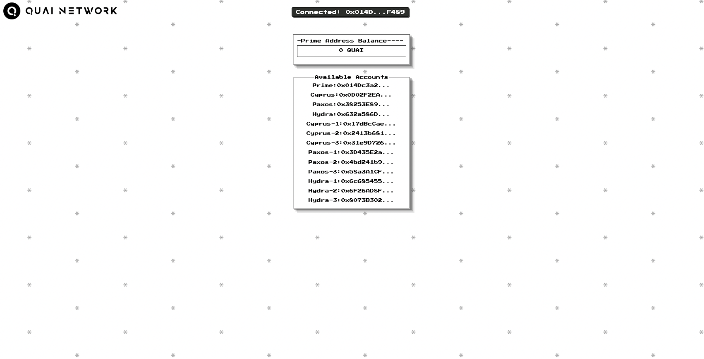

# quai-sample-dApp

An example dApp focused on the integration of quai-snap using html/css/js for developers looking to build on Quai Network.

## Description

The `quai-sample-dapp` is a basic frontend/backend integration of quai-snap. While this app is built using a simple html/css/js framework, it is highly recommended that developers utilize a more advanced framework like React.js.

This dApp onboards users to MetaMask Flask, installs the quai-snap npm package, generates a set 13 of accounts, and retrieves the balance of the prime account. Because of the limited scope of a traditional javascript backend, the dApp offers no additional functionalities.

The app utilizes [Browserify's](https://browserify.org/) bundling functionality to import node modules inside of the browser. 

The application can be seen below.

### Dependencies

* [node.js LTS version](https://nodejs.org/en/)
* [Browserify](https://browserify.org/)
* [@metamask/detect-provider package](https://www.npmjs.com/package/@metamask/detect-provider)
* [quai-snap npm package](https://www.npmjs.com/package/@quainetwork/quai-snap)

## Contributions

Contributions, testing, and general comments on the structure of this application are appreciated. Please contact the author if any bugs are found or improvements made!

## Authors

[Juuddi](https://twitter.com/Juuuuuddi) 
